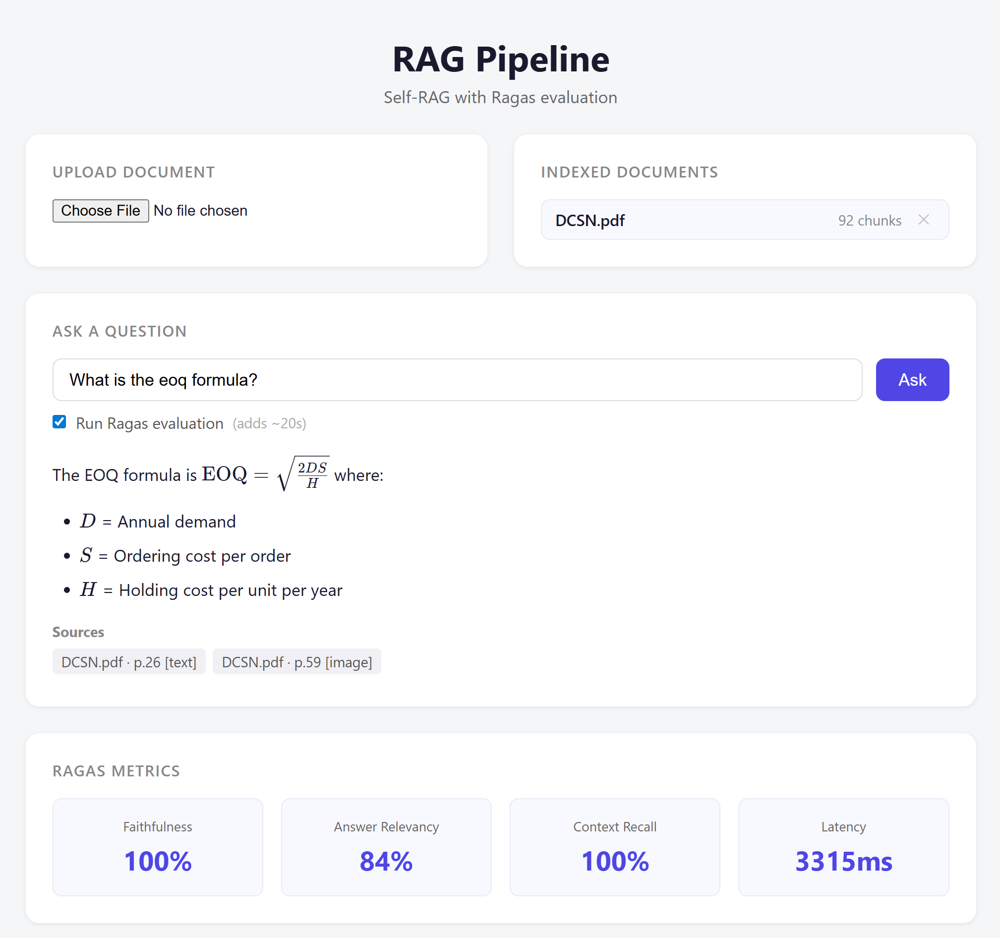

# rag-eval

A RAG pipeline with Self-RAG retrieval and automated Ragas evaluation. Upload PDFs, ask questions, get answers with faithfulness and relevancy scores.



## Stack

- **Backend** — FastAPI + LlamaIndex + pgvector
- **LLM** — OpenAI (gpt-4o) or Anthropic (claude) via env var
- **Evaluation** — Ragas (faithfulness, answer relevancy, context recall)
- **Frontend** — React + KaTeX for math rendering
- **Database** — PostgreSQL with pgvector extension

## Run locally

```bash
cp .env.example .env
# Add your OPENAI_API_KEY or ANTHROPIC_API_KEY + set LLM_PROVIDER=anthropic
docker-compose up --build
```

Open `http://localhost:5173`.

## API

| Method | Endpoint | Description |
|--------|----------|-------------|
| POST | `/api/documents` | Upload a PDF (parse → chunk → embed) |
| POST | `/api/query` | Ask a question, get answer + Ragas scores |
| GET | `/api/documents` | List indexed documents |
| DELETE | `/api/documents/{name}` | Remove a document |
| GET | `/api/history` | Last 50 queries with evaluation scores |

## How it works

**Upload:** PDF → PyMuPDF extracts text, tables (markdown), and images → vision LLM describes images → chunks embedded and stored in pgvector.

**Query:** Embed query → retrieve top-k chunks → LLM judges each chunk's marginal contribution → drop irrelevant chunks → re-retrieve with rephrased query if context is insufficient → generate answer from approved chunks only → Ragas evaluates in background.

## Environment variables

| Variable | Default | Description |
|----------|---------|-------------|
| `LLM_PROVIDER` | `openai` | `openai` or `anthropic` |
| `LLM_MODEL` | `gpt-4o` | Model name |
| `OPENAI_API_KEY` | — | Required for OpenAI |
| `ANTHROPIC_API_KEY` | — | Required for Anthropic |
| `EMBEDDING_MODEL` | `text-embedding-3-small` | Embedding model |
| `EMBEDDING_DIM` | `1536` | Must match the model's output dim |
| `RETRIEVAL_K` | `5` | Chunks to retrieve per query |
| `CHUNK_SIZE` | `512` | Token size for text splitting |

---

## Challenges solved

### Self-RAG re-retrieval loop
Standard RAG retrieves top-k and generates. Here a second LLM call scores each retrieved chunk's marginal contribution, if chunks are redundant or the set is collectively insufficient, it doubles k, rephrases the query to target a different part of the vector space, and retrieves again. Only approved chunks reach generation.

### Background Ragas evaluation without blocking the API
Ragas takes 5–30 seconds per query. Running it synchronously would make every query feel slow. The evaluator runs in a `ThreadPoolExecutor`, the API returns the answer immediately and Ragas writes scores to the database in the background.

### pgvector table missing before first upload
The `data_chunks` table is created by LlamaIndex on the first successful upload, not at startup. Until then, `GET /api/documents` would 500 on a missing relation. Fixed by catching `psycopg2.errors.UndefinedTable` and returning `[]` instead.

### Docker layer cache serving stale frontend builds
Vite bundles assets with content-hashed filenames, but when a Docker layer is cached the build step is skipped entirely. Changes to `App.jsx` appeared to deploy but the container was serving the previous image. Fixed by running `docker build --no-cache` when frontend source changes are not being picked up.
